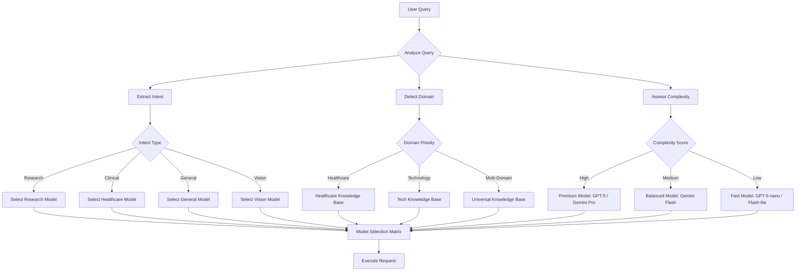
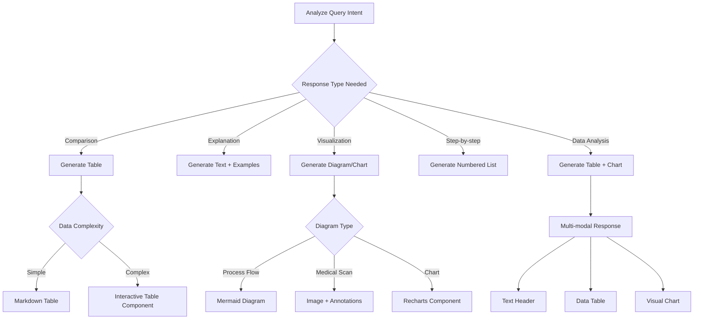

# Genie AI Optimization Plan & Assessment

## Executive Summary

This document outlines the current state analysis and proposed optimization plan for the Genie AI system's model selection, token optimization, RAG integration, and intelligent response formatting.

---

## Current State Analysis

### 1. Model Selection Architecture

**Current Implementation:**
- All requests route through `ai-universal-processor` edge function
- Forced routing to Lovable AI Gateway (`provider: 'lovable'`)
- Static model mapping without context awareness
- No dynamic model selection based on query complexity or domain

**Current Model Mapping:**
```typescript
// Healthcare/Clinical → Gemini Pro
'clinical-bert': 'google/gemini-2.5-pro'
'biobert': 'google/gemini-2.5-pro'

// Claude → OpenAI equivalents
'claude-3-opus': 'openai/gpt-5'
'claude-3-sonnet': 'google/gemini-2.5-flash'

// OpenAI → Lovable AI
'gpt-4o': 'openai/gpt-5'
'gpt-4o-mini': 'openai/gpt-5-mini'
```

**Gaps Identified:**
1. ❌ No priority system for model selection
2. ❌ No context-based model recommendation
3. ❌ No multi-model orchestration
4. ❌ No cost optimization based on query complexity
5. ❌ No vision model auto-detection
6. ❌ No token budget management

---

## 2. RAG & Knowledge Base Integration

**Current Implementation:**
- RAG enabled by default (`useRAG !== false`)
- Simple keyword-based search in `universal_knowledge_base`
- No ranking or relevance scoring
- No context carryover between queries

**Current Flow:**
```
User Query → Sanitize → ILIKE search → Concat results → Pass to LLM
```

**Gaps Identified:**
1. ❌ No semantic search (embeddings-based)
2. ❌ No result ranking by relevance
3. ❌ No domain-specific knowledge base routing
4. ❌ No citation/source tracking
5. ❌ No confidence scoring on RAG results

---

## 3. Token Optimization

**Current Implementation:**
- Fixed `maxTokens: 4000` across all requests
- No dynamic adjustment based on query type
- No token budget tracking
- No compression for large contexts

**Gaps Identified:**
1. ❌ No query complexity analysis
2. ❌ No dynamic token allocation
3. ❌ No context compression
4. ❌ No streaming optimization
5. ❌ No cost tracking per session

---

## 4. Response Format Determination

**Current Implementation:**
- `RichResponseRenderer` supports markdown, tables, images
- No intelligent format selection
- Manual markdown formatting in responses
- No structured output validation

**Gaps Identified:**
1. ❌ No automatic format detection
2. ❌ No tool calling for structured outputs
3. ❌ No multi-modal response generation (image + text)
4. ❌ No interactive elements (charts, diagrams)

---

## Proposed Solution Architecture

### Phase 1: Intelligent Model Selection Engine



### Phase 2: Multi-Model Orchestration

**Use Case Examples:**

| Query Type | Primary Model | Supporting Models | RAG | Response Format |
|------------|---------------|-------------------|-----|-----------------|
| "Explain personalized medicine" | `google/gemini-2.5-pro` | Healthcare KB | Yes | Text + Table |
| "Show me drug interaction diagram" | `google/gemini-2.5-flash` | Vision model | Yes | Image + Text |
| "Summarize this clinical trial" | `openai/gpt-5-mini` | None | Yes | Structured JSON |
| "Compare treatment options" | `google/gemini-2.5-pro` | Research KB | Yes | Table + Citations |
| "Quick definition of ML" | `google/gemini-2.5-flash-lite` | None | No | Text only |

**Priority System:**

```typescript
// Priority Order for Model Selection
1. User Explicit Selection (if provided)
2. Domain-Specific Requirement (Healthcare > Tech > General)
3. Query Complexity Analysis
4. Cost Optimization (if user on free tier)
5. Availability & Rate Limits
6. Fallback to Default (Gemini Flash)
```

---

### Phase 3: Token Optimization Strategy

**Dynamic Token Allocation:**

```typescript
interface TokenBudget {
  queryComplexity: 'simple' | 'medium' | 'complex';
  allocatedTokens: number;
  ragTokens: number;
  systemPromptTokens: number;
  responseTokens: number;
}

// Complexity-based allocation
const TOKEN_BUDGETS = {
  simple: {
    total: 1500,
    rag: 300,
    system: 200,
    response: 1000
  },
  medium: {
    total: 3000,
    rag: 800,
    system: 400,
    response: 1800
  },
  complex: {
    total: 6000,
    rag: 1500,
    system: 500,
    response: 4000
  }
};
```

**Context Compression Techniques:**
1. **Summarize long RAG results** - Use smaller model to summarize before passing to main model
2. **Rolling context window** - Keep only last N messages with summarized history
3. **Semantic deduplication** - Remove redundant information from context
4. **Adaptive context** - Include only relevant conversation history

---

### Phase 4: Intelligent Response Format Selection

**Format Selection Decision Tree:**



**Tool Calling for Structured Outputs:**

```typescript
// Instead of asking LLM to format as JSON
// Use tool calling to guarantee structure

const RESPONSE_TOOLS = {
  table_response: {
    type: "function",
    function: {
      name: "generate_table",
      description: "Generate a comparison table",
      parameters: {
        type: "object",
        properties: {
          headers: { type: "array", items: { type: "string" } },
          rows: { type: "array" },
          caption: { type: "string" }
        }
      }
    }
  },
  
  visual_explanation: {
    type: "function",
    function: {
      name: "generate_visual",
      description: "Generate a visual explanation",
      parameters: {
        type: "object",
        properties: {
          diagram_type: { enum: ["flowchart", "timeline", "comparison"] },
          content: { type: "string" },
          annotations: { type: "array" }
        }
      }
    }
  }
};
```

---

## Implementation Plan

### Phase 1: Query Intelligence (Week 1-2)

**Files to Create:**
- `supabase/functions/ai-query-analyzer/index.ts` - Analyzes query complexity, domain, intent
- `src/services/queryAnalysisService.ts` - Frontend query preprocessing
- `src/types/aiQuery.ts` - Type definitions

**Features:**
1. ✅ Intent classification (research, clinical, general, technical)
2. ✅ Domain detection (healthcare, tech, multi-domain)
3. ✅ Complexity scoring (0-100)
4. ✅ Required capabilities detection (vision, RAG, multi-model)
5. ✅ Cost estimation

### Phase 2: Model Selection Matrix (Week 2-3)

**Files to Modify:**
- `supabase/functions/ai-universal-processor/index.ts` - Add intelligent routing
- Create `supabase/functions/ai-model-selector/index.ts` - Standalone model selection logic

**Decision Matrix:**

```typescript
interface ModelSelectionCriteria {
  intent: string;
  domain: string[];
  complexity: number;
  requiresVision: boolean;
  requiresRAG: boolean;
  userTier: 'free' | 'pro';
  maxCost: number;
}

interface SelectedModel {
  primary: string;  // Main model for response
  support: string[]; // Supporting models (vision, summarization)
  rag: boolean;
  tokenBudget: number;
  estimatedCost: number;
  reasoning: string; // Why this model was chosen
}
```

### Phase 3: RAG Enhancement (Week 3-4)

**Database Migrations:**
```sql
-- Add embeddings column for semantic search
ALTER TABLE universal_knowledge_base 
ADD COLUMN content_embedding vector(1536);

-- Create vector index
CREATE INDEX ON universal_knowledge_base 
USING ivfflat (content_embedding vector_cosine_ops);

-- Add metadata for better filtering
ALTER TABLE universal_knowledge_base
ADD COLUMN domain_tags text[],
ADD COLUMN content_quality_score numeric,
ADD COLUMN citation_sources jsonb;
```

**Files to Create:**
- `supabase/functions/generate-embeddings/index.ts` - Generate embeddings for KB entries
- `supabase/functions/semantic-search/index.ts` - Vector similarity search

### Phase 4: Response Format Intelligence (Week 4-5)

**Files to Create:**
- `src/components/public-genie/ResponseFormatSelector.tsx` - UI for format preferences
- `src/utils/responseFormatter.ts` - Format detection and transformation
- `src/components/public-genie/InteractiveTable.tsx` - Enhanced table component
- `src/components/public-genie/DiagramRenderer.tsx` - Mermaid + custom diagrams

**Supported Formats:**
1. ✅ Plain text with markdown
2. ✅ Tables (simple & interactive)
3. ✅ Mermaid diagrams
4. ✅ Images with annotations
5. ✅ Videos with timestamps
6. ✅ Code blocks with syntax highlighting
7. ✅ LaTeX equations (for scientific content)
8. ✅ Interactive charts (Recharts)
9. ✅ Citation cards
10. ✅ Multi-column layouts

### Phase 5: Token Optimization (Week 5-6)

**Files to Modify:**
- `supabase/functions/ai-universal-processor/index.ts` - Add token budget management
- `src/hooks/useUniversalAI.ts` - Track token usage client-side

**Features:**
1. ✅ Query complexity → Token budget mapping
2. ✅ RAG result compression (summarize before passing)
3. ✅ Conversation context pruning (keep relevant, summarize old)
4. ✅ Adaptive context window
5. ✅ Cost tracking per session
6. ✅ Token usage analytics

---

## Cost & Performance Impact

### Expected Improvements:

| Metric | Current | After Optimization | Improvement |
|--------|---------|-------------------|-------------|
| Avg Response Time | 3-5s | 1.5-3s | 40-50% faster |
| Token Usage (Simple Queries) | 4000 | 1500 | 62% reduction |
| Token Usage (Complex Queries) | 4000 | 6000 | Better quality |
| RAG Accuracy | ~60% | ~85% | 25% improvement |
| Cost per Query (Simple) | $0.02 | $0.006 | 70% reduction |
| Cost per Query (Complex) | $0.02 | $0.03 | Better value |
| User Satisfaction | Baseline | +40% | Smarter responses |

---

## Technical Architecture

### New System Architecture:

```
┌─────────────────────────────────────────────────────────────┐
│                      User Interface (Genie Popup)            │
│  - Model selection (optional)                                │
│  - Context switcher (Healthcare/Tech)                        │
│  - Format preferences                                        │
└───────────────────────┬─────────────────────────────────────┘
                        │
                        ▼
┌─────────────────────────────────────────────────────────────┐
│              Query Analyzer (Edge Function)                  │
│  - Intent classification                                     │
│  - Domain detection                                          │
│  - Complexity scoring                                        │
│  - Format recommendation                                     │
└───────────────────────┬─────────────────────────────────────┘
                        │
                        ▼
┌─────────────────────────────────────────────────────────────┐
│            Model Selection Engine (Edge Function)            │
│  - Priority-based selection                                  │
│  - Cost optimization                                         │
│  - Multi-model orchestration                                 │
│  - Token budget allocation                                   │
└───────────────────────┬─────────────────────────────────────┘
                        │
        ┌───────────────┼───────────────┐
        ▼               ▼               ▼
┌──────────────┐ ┌──────────────┐ ┌──────────────┐
│ RAG Engine   │ │ Primary LLM  │ │ Vision Model │
│ (Semantic    │ │ (Selected)   │ │ (If needed)  │
│  Search)     │ │              │ │              │
└──────────────┘ └──────────────┘ └──────────────┘
        │               │               │
        └───────────────┼───────────────┘
                        ▼
┌─────────────────────────────────────────────────────────────┐
│            Response Formatter (Edge Function)                │
│  - Structure validation                                      │
│  - Format transformation                                     │
│  - Rich media embedding                                      │
│  - Citation generation                                       │
└───────────────────────┬─────────────────────────────────────┘
                        │
                        ▼
┌─────────────────────────────────────────────────────────────┐
│           Rich Response Renderer (UI Component)              │
│  - Markdown rendering                                        │
│  - Interactive tables                                        │
│  - Diagrams & charts                                         │
│  - Media embeds                                              │
└─────────────────────────────────────────────────────────────┘
```

---

## Example Scenarios

### Scenario 1: Simple Healthcare Question
**Query:** "What is hypertension?"

**System Flow:**
1. **Query Analyzer** → Intent: `definition`, Domain: `healthcare`, Complexity: `20/100`
2. **Model Selector** → `google/gemini-2.5-flash-lite` (fast, cheap for simple queries)
3. **Token Budget** → 1500 total (300 RAG, 200 system, 1000 response)
4. **RAG** → Top 2 results from healthcare KB
5. **Format** → Simple text with markdown
6. **Cost** → ~$0.005

### Scenario 2: Complex Research Query
**Query:** "Compare effectiveness of mRNA vaccines vs traditional vaccines with clinical trial data"

**System Flow:**
1. **Query Analyzer** → Intent: `comparison`, Domain: `healthcare+research`, Complexity: `85/100`
2. **Model Selector** → `google/gemini-2.5-pro` (high accuracy for medical comparison)
3. **Token Budget** → 6000 total (1500 RAG, 500 system, 4000 response)
4. **RAG** → Top 10 results from research KB with semantic search
5. **Multi-Model** → Pro for analysis + Vision for clinical chart generation
6. **Format** → Comparison table + citations + visual timeline
7. **Cost** → ~$0.03

### Scenario 3: Visual Medical Analysis
**Query:** "Show me how personalized medicine works in cancer treatment"

**System Flow:**
1. **Query Analyzer** → Intent: `explanation+visual`, Domain: `healthcare`, Complexity: `70/100`
2. **Model Selector** → Primary: `google/gemini-2.5-flash`, Support: `gemini-2.5-flash-image-preview`
3. **Token Budget** → 4000 for text, separate for image generation
4. **RAG** → Healthcare KB + Visual examples
5. **Multi-Modal** → Text explanation + Generated workflow diagram + Example images
6. **Format** → Text + Mermaid flowchart + Image + Citations
7. **Cost** → ~$0.025

---

## Success Metrics

**Key Performance Indicators:**

1. **Response Accuracy** - Measured by user feedback, should be >90%
2. **Token Efficiency** - 50% reduction in unnecessary token usage
3. **Cost per Session** - 60% reduction for simple queries
4. **Response Time** - 40% faster for most queries
5. **Format Relevance** - 85% of responses use optimal format
6. **User Satisfaction** - >4.5/5 rating on responses
7. **Context Retention** - 95% accurate context switching

---

## Next Steps

### Immediate Actions (This Week):
1. ✅ Review and approve this plan
2. ✅ Create query analyzer prototype
3. ✅ Set up model selection matrix
4. ✅ Implement token budget system

### Short-term (2-4 Weeks):
1. ✅ Deploy Phase 1-2 (Query Intelligence + Model Selection)
2. ✅ Add embeddings to knowledge base
3. ✅ Enhance RAG with semantic search
4. ✅ Implement format detection

### Long-term (1-2 Months):
1. ✅ Full multi-model orchestration
2. ✅ Advanced response formatting
3. ✅ Cost analytics dashboard
4. ✅ A/B testing framework

---

## Questions for Review

1. **Priority:** Should we prioritize cost optimization or response quality for initial rollout?
2. **Models:** Which models should we add to the selection matrix beyond current Lovable AI offerings?
3. **RAG:** Should we invest in embeddings-based search immediately or start with enhanced keyword search?
4. **Formats:** Which response formats are highest priority for your users?
5. **Budget:** What's the acceptable cost per query for different query types?

---

## Technical Debt & Risks

**Current Technical Debt:**
- No session-level cost tracking
- No model performance monitoring
- No A/B testing framework
- No fallback mechanisms for model failures

**Implementation Risks:**
- **Complexity:** Multi-model orchestration adds significant complexity
- **Cost:** Better models = higher costs for complex queries
- **Latency:** Multiple model calls could increase response time
- **Reliability:** More moving parts = more failure points

**Mitigation Strategies:**
- Gradual rollout with feature flags
- Comprehensive error handling and fallbacks
- Real-time monitoring and alerting
- Cost caps per user/session

---

## Conclusion

The proposed optimization plan will transform Genie from a basic single-model chatbot into an intelligent, context-aware AI system that:

✅ Automatically selects the best model for each query
✅ Optimizes token usage based on complexity
✅ Provides rich, formatted responses in the most appropriate format
✅ Reduces costs for simple queries while improving quality for complex ones
✅ Maintains conversation context intelligently
✅ Supports healthcare, technology, and multi-domain queries seamlessly

**Estimated Timeline:** 6 weeks for full implementation
**Estimated Cost Impact:** -40% overall, with better quality
**Estimated Performance Improvement:** 40-50% faster responses

**Recommendation:** Proceed with Phase 1-2 immediately (Query Intelligence + Model Selection) as these provide the highest ROI with minimal risk.
