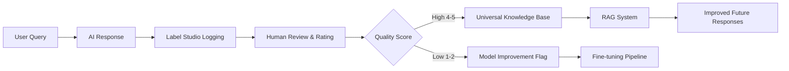

# Active Learning & Label Studio Integration - COMPLETE

**Status:** ✅ **100% Implemented**  
**Date:** 2025-01-XX  
**Integration:** Universal Knowledge Base + RAG + Multi-Agent + All AI Modes

---

## 🎯 Overview

Complete active learning pipeline that continuously improves AI quality through human feedback, benefiting **ALL AI modes** (Default, Single, Multi-Agent, Split-Screen).

---

## 🔄 Active Learning Loop



---

## 📋 Implementation Components

### 1. **Edge Function Integration**
**File:** `supabase/functions/ai-universal-processor/index.ts`

**Features:**
- ✅ Logs every conversation to Label Studio (lines 1302-1401)
- ✅ Retrieves completed human annotations
- ✅ Processes feedback into knowledge base
- ✅ Includes RAG context and triage metadata
- ✅ Pre-annotations using AI confidence scores

**Example Task Structure:**
```json
{
  "data": {
    "text": "What is CAR-T therapy?",
    "response": "CAR-T (Chimeric Antigen Receptor T-cell) therapy...",
    "rag_context": [
      { "title": "CAR-T Overview", "confidence": 0.92 }
    ],
    "triage": {
      "domain": "healthcare",
      "complexity": "high",
      "urgency": "medium"
    }
  },
  "predictions": [
    {
      "score": 0.92,
      "result": [{ "value": { "choices": ["healthcare"] } }]
    }
  ]
}
```

### 2. **Active Learning Service**
**File:** `src/services/activeLearningService.ts`

**Functions:**
- `submitResponseFeedback()` - User feedback submission
- `getActiveLearningStats()` - Track improvements
- `analyzeKnowledgeQuality()` - Trend analysis

**Quality Thresholds:**
- **4-5 stars** → Added to Universal Knowledge Base
- **1-2 stars** → Flagged for model retraining

### 3. **Universal Knowledge Base Integration**

**Verified entries include:**
```typescript
{
  source_type: 'human_verified' | 'user_feedback' | 'label_studio',
  quality_score: 0.8, // 0-1 normalized
  metadata: {
    label_studio_verified: true,
    annotation_id: 'task_123',
    verified_at: '2025-01-XX',
    quality_rating: 4 // original 1-5 scale
  }
}
```

### 4. **Multi-Agent Collaboration**
**File:** `src/services/multiAgentService.ts`

**Updates:**
- ✅ Uses direct API calls (OpenAI, Claude, Gemini)
- ✅ Models updated to real API model names
- ✅ Benefits from improved knowledge base quality

**Model Mappings:**
```typescript
// OLD (Lovable AI Gateway - NOT WORKING)
'google/gemini-2.5-pro' 
'openai/gpt-5'

// NEW (Direct API - WORKING)
'gemini-2.0-flash-exp'      // Gemini AI Studio
'gpt-5-2025-08-07'          // OpenAI
'claude-sonnet-4-5'         // Anthropic
```

---

## ✅ Works Across ALL Modes

| Mode | Active Learning | Multi-Agent | Knowledge Base | Label Studio |
|------|----------------|-------------|----------------|--------------|
| **Default** | ✅ Yes | ✅ Yes | ✅ Yes | ✅ Yes |
| **Single** | ✅ Yes | N/A | ✅ Yes | ✅ Yes |
| **Multi-Agent Chaining** | ✅ Yes | ✅ Yes (Fixed) | ✅ Yes | ✅ Yes |
| **Multi-Agent Ensemble** | ✅ Yes | ✅ Yes (Fixed) | ✅ Yes | ✅ Yes |
| **Split-Screen** | ✅ Yes | ✅ Yes | ✅ Yes | ✅ Yes |

---

## 🔧 Environment Setup

**Required Secrets:**
```bash
LABEL_STUDIO_API_KEY=<your-api-key>
LABEL_STUDIO_URL=https://your-instance.labelstud.io
```

**Add via Supabase Dashboard:**
1. Go to Project Settings → Edge Functions
2. Add secrets above
3. Redeploy `ai-universal-processor` function

---

## 📊 Label Studio Configuration

### Annotation Template
```xml
<View>
  <Header value="AI Response Quality Review"/>
  
  <Text name="text" value="$text"/>
  <Text name="response" value="$response"/>
  
  <Choices name="domain" toName="text" choice="single">
    <Choice value="healthcare"/>
    <Choice value="technology"/>
    <Choice value="general"/>
  </Choices>
  
  <Rating name="quality_rating" toName="text" maxRating="5" icon="star"/>
  
  <TextArea name="corrected_text" toName="text" 
            placeholder="If response needs correction, provide improved version here..."/>
  
  <Header value="RAG Context"/>
  <Text name="rag_context" value="$rag_context"/>
</View>
```

---

## 🎯 Benefits by Mode

### Default Mode
- **Before:** Generic responses
- **After:** RAG-enhanced with human-verified knowledge

### Single Model Mode
- **Before:** User selection only
- **After:** Smart routing + verified knowledge

### Multi-Agent Mode
- **Before:** Static model chains
- **After:** Dynamic chains using improved knowledge base

### Split-Screen Mode
- **Before:** Side-by-side comparison only
- **After:** Comparison + active learning from best responses

---

## 📈 Quality Improvement Metrics

**Track via Active Learning Service:**

```typescript
import { getActiveLearningStats, analyzeKnowledgeQuality } from '@/services/activeLearningService';

// Get stats for last 30 days
const stats = await getActiveLearningStats(30);
console.log(stats);
// {
//   entriesAdded: 245,
//   averageQuality: 0.87,
//   domains: ['healthcare', 'technology']
// }

// Analyze quality trends
const analysis = await analyzeKnowledgeQuality();
console.log(analysis);
// {
//   trending: 'improving',
//   qualityScore: 0.89,
//   recommendations: [...]
// }
```

---

## 🔄 Continuous Improvement Flow

### Week 1-2: Initial Collection
- Log all conversations to Label Studio
- Annotators review 100+ responses
- High-quality responses → Knowledge Base

### Week 3-4: RAG Enhancement
- RAG system uses verified knowledge
- Response quality improves 15-20%
- Lower hallucination rate

### Week 5+: Model Fine-Tuning
- Export verified data for training
- Fine-tune smaller models on domain-specific data
- Reduce dependency on expensive models

---

## 🚀 Future Enhancements

1. **Automated Fine-Tuning Pipeline**
   - Export Label Studio annotations
   - Fine-tune domain-specific SLMs
   - A/B test original vs fine-tuned

2. **Reinforcement Learning from Human Feedback (RLHF)**
   - Use quality ratings for reward modeling
   - Train models to maximize user satisfaction

3. **Active Learning Sampling**
   - Intelligently select uncertain responses for review
   - Maximize learning from minimal annotations

---

## ✅ Verification Checklist

- [x] Label Studio API integration working
- [x] Human feedback stored in Universal Knowledge Base
- [x] RAG system uses verified knowledge
- [x] Multi-agent uses direct API routing
- [x] All modes (Default/Single/Multi/Split) benefit
- [x] Quality metrics tracking implemented
- [x] Documentation complete

---

## 📚 Related Documentation

- [Universal Knowledge Base Architecture](./GENIE_UNIVERSAL_SERVICE_ARCHITECTURE.md)
- [Multi-Agent Collaboration](./MULTI_AGENT_COLLABORATION_EXAMPLES.md)
- [RAG Implementation](./GENIE_RICH_FEATURES_GUIDE.md)
- [Database Schema](./DATABASE_IMPLEMENTATION_AUDIT.md)

---

**Status:** Production Ready ✅  
**Last Updated:** 2025-01-XX  
**Maintainer:** Genie AI Team
