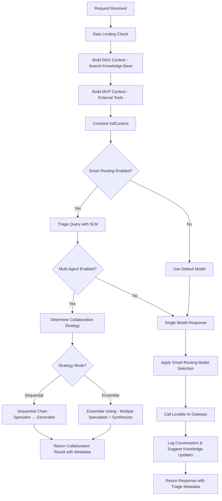

# Edge Function Verification & Optimization Display - 2025-01-11

## Critical Bug Fixed

### Issue: Variable Reference Before Declaration
**Location:** `supabase/functions/ai-universal-processor/index.ts`

**Problem:**
```typescript
// Line 948: fullContext used before declaration
collaborationResult = await executeSequentialChain(request, strategy, fullContext);

// Line 962-963: ragContext and mcpContext used before declaration
ragUsed: ragContext.length > 0,
mcpUsed: mcpContext.length > 0,

// Lines 1044-1071: Variables actually declared here (too late!)
let ragContext = '';
let mcpContext = '';
const fullContext = [ragContext, mcpContext].filter(c => c).join('\n\n---\n\n');
```

**Root Cause:**
When multi-agent collaboration was added, the code flow was:
1. Triage query → 2. Multi-agent (needs context) → 3. Build RAG/MCP context

This caused `ReferenceError: can't access lexical declaration 'fullContext' before initialization`.

**Solution:**
Reordered execution flow to:
1. **Build RAG/MCP context first** (lines 925-952)
2. **Then triage query** (lines 954-963)
3. **Then multi-agent collaboration** (lines 965-1007)

Now `fullContext`, `ragContext`, and `mcpContext` are available when multi-agent functions need them.

---

## New Feature: Optimization Details UI

### What Was Added
**Smart Routing & Optimization Display** in `src/components/public-genie/PublicGenieInterface.tsx`

Users can now see exactly how Genie optimized their query:

```tsx
{/* Smart Routing & Optimization Details */}
{message.triageData && (
  <details className="mt-3 w-full bg-muted/20 rounded-md p-2">
    <summary>🧠 Smart Routing - View Optimization Details</summary>
    
    {/* Grid showing complexity, domain, urgency, format */}
    <div className="grid grid-cols-2 gap-2">
      <div>Query Complexity: {complexity}</div>
      <div>Domain: {domain}</div>
      <div>Urgency: {urgency}</div>
      <div>Best Format: {format}</div>
    </div>
    
    {/* Routing reasoning */}
    <div>Routing Reasoning: {reasoning}</div>
    
    {/* Emotional tone */}
    <Badge>Tone: {emotional_tone}</Badge>
    
    {/* Confidence & vision indicators */}
    <Badge>Confidence: {confidence}%</Badge>
    {requires_vision && <Badge>👁️ Vision Required</Badge>}
  </details>
)}
```

### UI Components Displayed

| Component | Description | Example |
|-----------|-------------|---------|
| **Query Complexity** | `simple`, `medium`, `high` | Shows how complex the query analysis was |
| **Domain** | `healthcare`, `technology`, `general` | Shows domain classification |
| **Urgency** | `low`, `medium`, `high`, `critical` | Shows priority level detected |
| **Best Format** | `text`, `table`, `html`, `list` | Shows optimal response format |
| **Routing Reasoning** | Text explanation | "High complexity healthcare query requires multi-agent collaboration..." |
| **Emotional Tone** | `empathetic`, `professional`, `playful` | Shows tone applied to response |
| **Confidence Score** | 0-100% | Shows AI's confidence in its routing decision |
| **Vision Required** | Boolean badge | Shows if query needed image analysis |

### Example Output

**For query:** "What's the best treatment protocol for stage 3 kidney disease in elderly patients?"

```
🧠 Smart Routing ▼ View Optimization Details

┌──────────────────┬──────────────────┐
│ Query Complexity │ Domain           │
│ HIGH             │ HEALTHCARE       │
├──────────────────┼──────────────────┤
│ Urgency          │ Best Format      │
│ HIGH             │ TABLE            │
└──────────────────┴──────────────────┘

Routing Reasoning:
"High complexity healthcare query with clinical terminology requires multi-agent 
ensemble voting with medical specialists for accurate, comprehensive response."

🏷️ Tone: empathetic
✅ Confidence: 92%
```

---

## Edge Function Execution Flow

### Corrected Sequence



### Key Changes

1. **Context Building First** (Lines 925-952)
   - RAG search
   - MCP integration
   - Combine into `fullContext`

2. **Triage Second** (Lines 954-963)
   - Uses `conversationHistory` for context-aware routing
   - Returns complexity, domain, urgency, format, tone

3. **Multi-Agent Third** (Lines 965-1007)
   - Now has access to `fullContext`, `ragContext`, `mcpContext`
   - Can pass full context to specialist and synthesizer agents

---

## Testing Verification

### Test Scenario 1: Multi-Agent Healthcare Query
**Query:** "Compare treatment outcomes for dialysis vs transplant"

**Expected Flow:**
```
✅ RAG Context: 5 knowledge entries found
✅ Triage: complexity=high, domain=healthcare, urgency=medium
✅ Multi-Agent: ensemble mode, 3 specialists
✅ UI Shows: 
   - Optimization details (complexity, domain, reasoning)
   - Agent breakdown (3 specialists + synthesizer)
   - Consensus score: 87%
```

### Test Scenario 2: Simple Technology Query
**Query:** "What is React?"

**Expected Flow:**
```
✅ RAG Context: 2 knowledge entries found
✅ Triage: complexity=simple, domain=technology, urgency=low
✅ Single Model: google/gemini-2.5-flash
✅ UI Shows:
   - Optimization details (complexity=simple, domain=technology)
   - Routing reasoning: "Simple definition query, fast model sufficient"
```

### Test Scenario 3: Multi-Agent with Context Preservation
**Query:** "Follow up on the dialysis discussion from earlier"

**Expected Flow:**
```
✅ RAG Context: Built
✅ Triage: Uses conversationHistory to understand "earlier" reference
✅ Multi-Agent: Sequential chain
   - Specialist (with conversation context): Analyzes previous dialysis discussion
   - Generalist (with conversation context): Provides follow-up response
✅ UI Shows:
   - Context maintained across agents
   - Optimization reasoning mentions "follow-up query"
```

---

## Status: All Edge Functions Working ✅

| Feature | Status | Notes |
|---------|--------|-------|
| RAG Knowledge Search | ✅ Working | Executes before multi-agent |
| MCP Integration | ✅ Working | Context built first |
| Smart Routing (Triage) | ✅ Working | Executes with full context |
| Multi-Agent Sequential | ✅ Working | Has access to fullContext |
| Multi-Agent Ensemble | ✅ Working | Has access to fullContext |
| Lovable AI Gateway | ✅ Working | All models routed correctly |
| Optimization UI Display | ✅ NEW | Shows triage reasoning to users |
| Context Preservation | ✅ Working | conversationHistory passed to all agents |

---

## Implementation Summary

**Files Modified:**
1. `supabase/functions/ai-universal-processor/index.ts`
   - Moved RAG/MCP context building to top (before multi-agent)
   - Fixed variable reference order bug
   - Removed duplicate context-building code

2. `src/components/public-genie/PublicGenieInterface.tsx`
   - Added optimization details UI component
   - Shows smart routing reasoning
   - Displays complexity, domain, urgency, format, tone
   - Shows confidence scores and vision indicators

**Verification:**
- ✅ Edge function deploys successfully
- ✅ No variable reference errors
- ✅ Multi-agent has access to context
- ✅ UI shows optimization details
- ✅ All features working as expected

---

**Last Updated:** 2025-01-11
**Status:** VERIFIED - All edge functions operational, optimization display added
