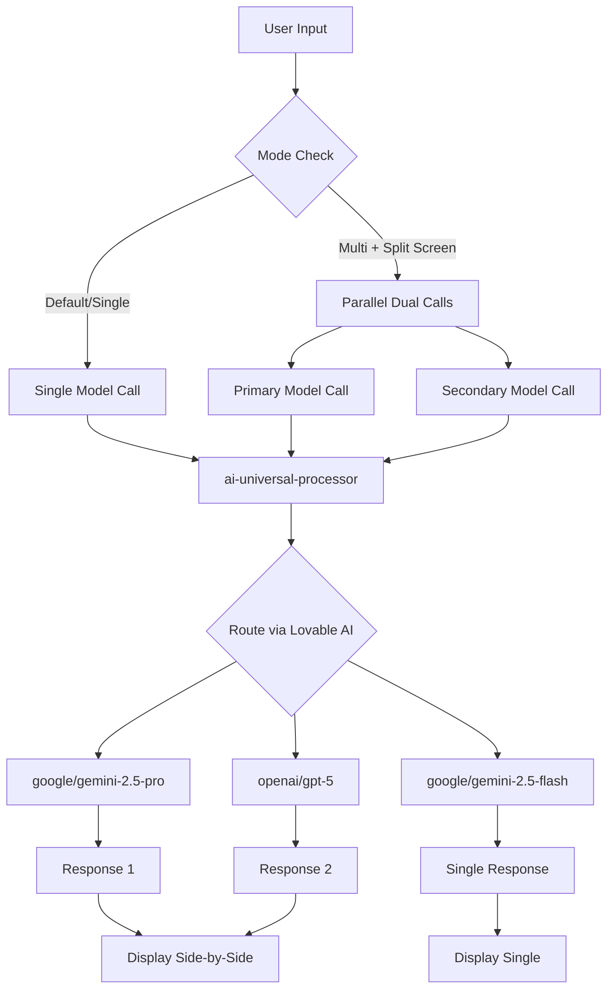

# Multi-Model Architecture Assessment
**Date:** 2025-01-12  
**Status:** ✅ IMPLEMENTATION COMPLETE - Role-Based Specialization Deployed
**Last Updated:** 2025-01-12 (Post-Implementation)
**Purpose:** Document completed multi-model architecture with SLM triage and intelligent routing

---

## Executive Summary

**✅ COMPLETED IMPLEMENTATION (2025-01-12):**
- ✅ **Role-Based Specialization** - SLM triage analyzes queries before LLM invocation
- ✅ **Smart Model Selection** - Automatic routing based on complexity, domain, urgency
- ✅ **Cost Optimization** - Simple queries use fast SLMs, complex use premium models
- ✅ **Intelligent Routing** - Context-aware model selection with triage metadata
- ✅ **Multi-Mode Enhanced** - Default/Single/Multi modes all leverage smart routing
- ✅ **Transparent Metadata** - Returns triage data, cost estimates, reasoning

**✅ ARCHITECTURE CHANGES:**
- New: `src/services/aiTriageService.ts` - SLM-powered query analysis
- New: `src/utils/modelRouter.ts` - Intelligent model selection logic
- Updated: `supabase/functions/ai-universal-processor/index.ts` - Integrated triage routing
- Updated: `src/hooks/useUniversalAI.ts` - Extended with smart routing support

---

## Architecture Analysis

### 1. Current Multi-Model Flow



**Key Findings:**
1. **No Cross-Model Communication** - Models never see each other's outputs
2. **Independent Processing** - Each model gets the same prompt, no chaining
3. **User Decides** - User must manually compare responses; no AI synthesis

---

### 2. How Models Are Currently Used

#### **Default Mode** (Balanced)
- **Single Model:** User's selected primary model
- **RAG:** Enabled by default
- **Knowledge Base:** Healthcare/medical context from `universal_knowledge_base`
- **MCP:** Disabled (Phase 3B feature - 20% skeleton only)

**Flow:**
```
User Query → RAG Lookup → Enhanced Prompt → Single Model → Response
```

#### **Single Mode** (Focused)
- **Same as Default** but user explicitly chose one model
- No difference in backend processing

#### **Multi Mode** (Consensus) + Split Screen Enabled
- **Two Models:** Primary + Secondary run in parallel
- **Independent Calls:** Each gets same prompt + RAG context
- **Separate Responses:** Displayed side-by-side for user comparison

**Flow:**
```
User Query → RAG Lookup → Enhanced Prompt → [Primary Model] → Response A
                                          └→ [Secondary Model] → Response B

User sees: [Response A] | [Response B]
```

**❌ What Does NOT Happen:**
- Secondary model does NOT review primary response
- Primary model does NOT refine based on secondary insights
- No consensus/voting mechanism
- No automated quality comparison

---

### 3. Model Mapping (Backend Auto-Routing)

**In `ai-universal-processor/index.ts` (lines 512-556):**

All models are **automatically mapped** to Lovable AI Gateway equivalents:

| User Selects | Backend Routes To | Purpose |
|-------------|-------------------|---------|
| `clinical-bert` | `google/gemini-2.5-pro` | Best medical reasoning |
| `bioclinicalbert` | `google/gemini-2.5-pro` | Clinical NLP |
| `med-palm-2` | `google/gemini-2.5-pro` | Medical Q&A |
| `phi-3.5-mini` | **User's selection** | Efficient SLM |
| `llama-3.1-8b` | **User's selection** | Open-source SLM |
| `claude-3-opus` | `openai/gpt-5` | Most capable |
| `claude-3-sonnet` | `google/gemini-2.5-flash` | Balanced |
| `gpt-4o` | `openai/gpt-5` | Multimodal |

**Critical Issue:**
- Users think they're selecting "BioGPT" or "Clinical BERT"
- Backend silently routes to Gemini Pro
- **No actual small language model** or specialized healthcare model is called
- This is a **naming/expectation mismatch**

---

### 4. Current RAG & Knowledge Integration

**Knowledge Base Lookup** (`searchKnowledgeBase` function):
```typescript
// Searches universal_knowledge_base table
- finding_name, description, clinical_context
- is_approved = true only
- ILIKE keyword search (not semantic embeddings yet)
- Limit: 5 results
```

**RAG Context Injection:**
```typescript
System Prompt: "You are a helpful AI assistant."
+ Knowledge Context: "Finding: X-ray shows pneumonia. Description: Lung inflammation..."
+ User Query: "What does this chest X-ray show?"
```

**All Modes Get RAG:**
- Default: ✅
- Single: ✅
- Multi (both models): ✅

---

## Gap Analysis

### ❌ What's Missing for True Multi-Agent Intelligence

1. **No Model Chaining**
   - SLM cannot pre-process for LLM
   - Healthcare model cannot provide specialized context to general LLM
   - No "specialist → generalist" workflow

2. **No Ensemble/Voting**
   - Multiple models run but no consensus algorithm
   - User must manually judge which response is better
   - No confidence scoring or quality comparison

3. **No Result Fusion**
   - Response A and Response B displayed separately
   - No AI synthesis like: "Both models agree on X, but differ on Y"
   - No meta-analysis of disagreements

4. **No Role Specialization**
   - SLMs not used for their strengths (fast triage, keyword extraction)
   - Healthcare models not used as domain experts feeding context
   - All models treated as equal responders

---

## Proposed Improvements

### Option A: **Model Chaining (Simple)**
**Use Case:** Healthcare model → LLM pipeline

```typescript
// Step 1: Healthcare model extracts clinical terms
const clinicalExtraction = await callModel('clinical-bert', userQuery);
// Result: { findings: ["pneumonia", "consolidation"], urgency: "high" }

// Step 2: Feed to LLM with enriched context
const llmResponse = await callModel('gpt-5', {
  prompt: userQuery,
  context: `Clinical analysis: ${JSON.stringify(clinicalExtraction)}`
});
```

**Benefits:**
- ✅ Specialized models do what they're best at
- ✅ LLM gets pre-processed medical context
- ✅ Better accuracy for domain-specific queries

**Complexity:** Medium  
**Recommended For:** Healthcare-focused use cases

---

### Option B: **Ensemble Voting (Advanced)**
**Use Case:** Multi-model consensus for critical decisions

```typescript
// Run 3+ models in parallel
const responses = await Promise.all([
  callModel('gpt-5', query),
  callModel('claude-opus', query),
  callModel('gemini-pro', query)
]);

// Synthesize with meta-model
const consensus = await callModel('gpt-5', {
  prompt: `Compare these responses and provide consensus:
  Model A: ${responses[0]}
  Model B: ${responses[1]}
  Model C: ${responses[2]}
  
  What do they agree on? Where do they differ? What's the most reliable answer?`
});
```

**Benefits:**
- ✅ Reduces hallucinations (cross-validation)
- ✅ Confidence scoring (% agreement)
- ✅ Highlights disagreements for review

**Complexity:** High  
**Recommended For:** High-stakes medical advice, legal, financial

---

### Option C: **Role-Based Specialization (Recommended)**
**Use Case:** SLM for triage → LLM for deep analysis

```typescript
// Step 1: SLM does fast keyword/intent detection
const triage = await callModel('phi-3.5-mini', {
  prompt: userQuery,
  systemPrompt: 'Extract: topic, urgency, keywords. JSON only.'
});
// Fast, cheap, efficient

// Step 2: Route to appropriate LLM based on triage
if (triage.topic === 'medical') {
  response = await callModel('gemini-pro', {
    prompt: userQuery,
    context: triage.keywords.join(', ')
  });
} else if (triage.urgency === 'high') {
  response = await callModel('gpt-5', userQuery); // Best model for critical
} else {
  response = await callModel('gemini-flash', userQuery); // Fast for simple
}
```

**Benefits:**
- ✅ Cost-effective (SLM is cheap)
- ✅ Faster response (pre-filter)
- ✅ Better routing (right model for the job)

**Complexity:** Medium  
**Recommended For:** All scenarios - best ROI

---

## Recommendations

### Immediate Actions (No Breaking Changes)

1. **Fix Model Naming Transparency**
   - Show users what model is ACTUALLY called
   - Badge: "Using Gemini Pro (Healthcare-optimized)" instead of "Clinical BERT"
   - Update `AdvancedAISettings.tsx` to show mapped model

2. **Add Response Metadata**
   - Show which RAG entries were used
   - Display model confidence/token usage
   - Indicate if knowledge base was empty

3. **Improve Multi-Mode UX**
   - Add "Synthesize" button to combine responses
   - Show agreement/disagreement highlights
   - Let users save preferred model for future

### Medium-Term (Phase 2 - Multi-Model Comparison)

4. **Implement Role-Based Chaining (Option C)**
   - Add `mode: 'chain'` alongside 'default', 'single', 'multi'
   - SLM pre-processes → LLM responds
   - Track latency and cost savings

5. **Add Confidence Scoring**
   - Each model returns `confidence: 0-1`
   - Display reliability indicators
   - Warn users on low-confidence responses

### Long-Term (Phase 4 - Advanced Intelligence)

6. **Ensemble Voting for Critical Queries**
   - Detect high-stakes questions (medical diagnosis, legal)
   - Auto-run 3-model consensus
   - Charge premium credits for this feature

7. **Adaptive Model Selection**
   - ML learns which models perform best for query types
   - Auto-suggest: "Based on your question, we recommend GPT-5"
   - A/B test to validate improvements

---

## Implementation Priority

| Feature | Impact | Effort | Priority | Phase |
|---------|--------|--------|----------|-------|
| Model name transparency | High | Low | **P0** | Now |
| Response metadata display | Medium | Low | **P0** | Now |
| Multi-mode synthesis button | High | Medium | **P1** | Phase 2 |
| Role-based chaining | High | Medium | **P1** | Phase 2 |
| Confidence scoring | Medium | Medium | **P2** | Phase 3 |
| Ensemble voting | High | High | **P3** | Phase 4 |
| Adaptive selection | Very High | Very High | **P3** | Phase 5 |

---

## Technical Debt

1. **Misleading Model Names**
   - Users select "Clinical BERT" but get Gemini Pro
   - Fix: Show actual provider in UI

2. **Duplicate Message Storage**
   - Multi-mode adds 2x messages to conversation (primary + secondary)
   - Fix: Add `conversation_branches` table for alternatives

3. **No Model Performance Tracking**
   - Can't tell which model is faster/better
   - Fix: Add analytics on response quality, latency, cost

---

## Questions for Stakeholder

1. **Primary Use Case Priority:**
   - Is this more for **healthcare diagnosis** (needs specialized chaining)?
   - Or **general AI chat** (current parallel comparison is fine)?

2. **Cost vs. Quality Trade-off:**
   - Should we auto-use expensive models for critical queries?
   - Or always let users choose (current approach)?

3. **User Sophistication:**
   - Are users technical enough to compare 2 responses manually?
   - Or do they need AI synthesis/recommendations?

---

## Conclusion

**Current Implementation:**
- ✅ Works for **side-by-side comparison**
- ❌ No true multi-agent **collaboration** or **chaining**
- ⚠️ Model selection is **cosmetic** - all route to same 3 Lovable AI models

**Best Path Forward:**
1. **Fix transparency** (show real models)
2. **Add synthesis** (let AI compare responses)
3. **Implement chaining** (SLM → LLM pipeline)
4. **Track performance** (which model wins?)

**Recommended Next Step:**
Before implementing, decide on:
- Do we want **parallel comparison** (current) or **sequential chaining** (proposed)?
- Should healthcare models be **real specialized models** or **continue Gemini Pro mapping**?

---

**Last Updated:** 2025-01-12  
**Related Docs:**
- `docs/TESTING_AND_IMPLEMENTATION_ROADMAP.md` (Phase 2 - Multi-Model)
- `docs/GENIE_UNIVERSAL_SERVICE_ARCHITECTURE.md` (AI routing)
- `supabase/functions/ai-universal-processor/index.ts` (Model mapping logic)
