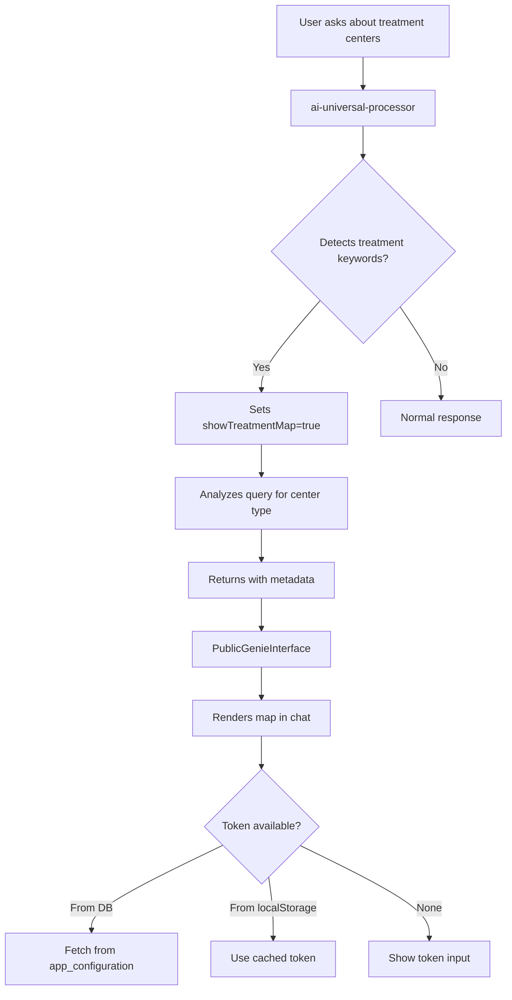

# Treatment Center Map Integration

## Overview
The treatment center map is fully integrated into Genie AI's conversation flow with intelligent detection of when to display it.

## How It Works

### 1. **Intelligent Map Display**
The map automatically appears in Genie chat when users ask about:
- Treatment centers (gene therapy, BMT, transplant, oncology)
- Clinical trials and research centers
- Hospital/clinic locations
- Location-based queries ("where can I get...", "near me", "find treatment")

### 2. **Smart Context Detection**
The AI edge function (`ai-universal-processor`) analyzes user queries for:

**General Treatment Keywords:**
- treatment center, hospital, clinic, medical center

**Specific Therapies:**
- gene therapy, CAR-T therapy, cell therapy → shows `gene_therapy` centers
- BMT, bone marrow transplant → shows `bmt` centers  
- oncology, cancer, infusion → shows `oncology` centers

**Clinical Trials:**
- clinical trial, trial site, research center → shows all types (with refinement based on therapy mentioned)

**Location Queries:**
- "near me", "in my area", "closest", "find a center"

### 3. **Mapbox Token Management**

#### **Option 1: User Self-Service (Default)**
Users enter their Mapbox token directly in the map interface:
- Token is stored in browser's localStorage
- Persists across sessions
- No admin intervention needed

#### **Option 2: Centralized Admin Management**
Admins can set a single token for all users:
1. Go to Admin Dashboard → Settings tab
2. Enter Mapbox public token (starts with `pk.`)
3. Token is stored in `app_configuration` table
4. All users automatically use this token
5. Falls back to user's localStorage if no admin token set

**Why Mapbox Tokens Are Public:**
- Mapbox public tokens (pk.*) are designed to be used on the client side
- They are NOT secrets and should NOT be stored in edge function secrets
- They are domain-restricted, so even if exposed, they only work on your domain
- Storing in localStorage or database is the correct approach

### 4. **Database Schema**

**Treatment Centers Table:**
```sql
treatment_centers
├── id (uuid)
├── name (text)
├── center_type (text) - 'gene_therapy', 'bmt', 'oncology', 'general'
├── latitude (numeric)
├── longitude (numeric)
├── address, city, state, zip_code
├── phone, website, email
├── specialties (text[])
├── is_verified (boolean)
└── source information
```

**Configuration Table:**
```sql
app_configuration
├── config_key (text) - 'mapbox_public_token'
├── config_value (text) - The actual token
├── is_public (boolean) - true (readable by all)
└── metadata
```

### 5. **Data Flow**



### 6. **Clinical Trials Integration**

Clinical trial queries are intelligently routed:
- "gene therapy clinical trial" → shows gene_therapy centers
- "cancer clinical trial" → shows oncology centers
- "clinical trial near me" → shows all types

The system understands that clinical trials can be conducted at various center types and filters accordingly.

### 7. **User Experience**

**When map is shown:**
1. User asks: "Where can I get CAR-T therapy near Boston?"
2. Genie responds with answer text
3. Interactive map appears below the response
4. Map is filtered to show only gene_therapy centers
5. User can click markers to see center details
6. Centers near Boston are highlighted

**Map Features:**
- Color-coded markers by center type
- Click to view full center details
- Zoom/pan/fullscreen controls
- Filter by center type
- Auto-fit bounds to show all centers
- Search capabilities

### 8. **Security & Privacy**

- ✅ RLS policies protect treatment center data
- ✅ Only admins can update Mapbox token in database
- ✅ Public configs are readable by all (necessary for maps)
- ✅ No sensitive data exposed
- ✅ Mapbox tokens are public by design

### 9. **Admin Setup**

**To enable centralized token management:**
1. Navigate to Admin Dashboard
2. Click "Settings" tab
3. Enter your Mapbox public token (get from https://account.mapbox.com/)
4. Click "Save Token"
5. All users will now use this token automatically

### 10. **Technical Implementation**

**Edge Function Detection:**
```typescript
// In ai-universal-processor/index.ts
const treatmentCenterKeywords = [
  'treatment center', 'clinical trial', 'gene therapy', 
  'bmt center', 'hospital', 'near me', ...
];

const showTreatmentMap = treatmentCenterKeywords.some(keyword => 
  request.prompt.toLowerCase().includes(keyword)
);
```

**Frontend Integration:**
```typescript
// In PublicGenieInterface.tsx
{(message as any).metadata?.showTreatmentMap && (
  <InteractiveTreatmentCenterMap 
    filterByType={(message as any).metadata?.centerType}
    searchQuery={(message as any).metadata?.searchQuery}
  />
)}
```

## Best Practices

1. **Token Management:**
   - Use centralized admin token for production
   - Allow user self-service for development
   - Keep tokens in version control's .gitignore

2. **Data Quality:**
   - Regularly update treatment center data
   - Verify center information accuracy
   - Keep clinical trial information current

3. **User Experience:**
   - Test map on various devices
   - Ensure mobile responsiveness
   - Provide clear instructions for token input

4. **Performance:**
   - Map only loads when needed
   - Markers rendered efficiently
   - Token cached for performance

## Future Enhancements

- [ ] Auto-geocoding of user location
- [ ] Distance calculations from user
- [ ] Clinical trial phase filtering
- [ ] Center ratings/reviews
- [ ] Appointment scheduling integration
- [ ] Multi-language support

---

**Last Updated:** 2025-01-15
**Status:** ✅ Fully Integrated
